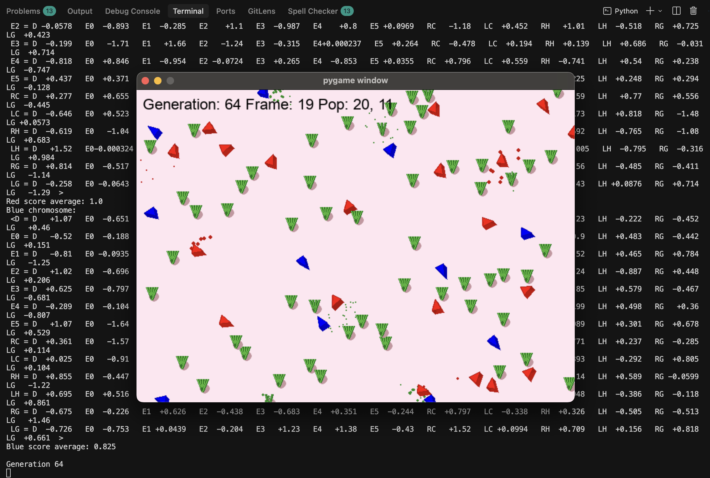

# Flatworld

Flatworld is a simulation game using the Pygame library that creates a grasslands biome with carnivores and herbivores who learn how to survive and compete for resources.



It explores the AI concepts of Fuzzy logic, Subsumption, The genetic algorithm, Perceptron, Sigmoids and more.  We use a neural network to train the creatures using genes which are the weights  for a neural network.  Perceptrons  represent what the creatures see and how they move.

This work is based on the code samples in the book `Artificial Intelligence for Developers` by Richard Urwin.

## Running the Neural Flatworld

The `NeuralFlatworld.py` script requires TensorFlow, which needs Python 3.12 or earlier (TensorFlow doesn't support Python 3.14+). A virtual environment can be set up with all required dependencies, and run as such:

```sh
venv/bin/python NeuralFlatworld.py
```

## Useful Terms

- [Fuzzy logic](https://en.wikipedia.org/wiki/Fuzzy_logic) - a form of many-valued logic in which the truth value of variables may be any real number between 0 and 1.
- [Subsumption](https://en.wikipedia.org/wiki/Subsumption) - a reactive robotic architecture heavily associated with behavior-based robotics.
- [The genetic algorithm](https://en.wikipedia.org/wiki/Genetic_algorithm) - a metaheuristic inspired by the process of natural selection that belongs to the larger class of evolutionary algorithms.
- [Perceptron](https://en.wikipedia.org/wiki/Perceptron) - an algorithm for supervised learning of binary classifiers. 
- [Sigmoid](https://en.wikipedia.org/wiki/Sigmoid_function) - a non-linear mathematical function whose graph has a characteristic S-shaped or sigmoid curve.

## Architecture

To change the speed of the action, look at NeuralFlatworld.py:

```py
if enableDraw:
    clock.tick(15)  # Quarter speed: 15 FPS instead of 60 FPS
```

### Prerequisites

The virtual environment (`venv`) includes:
- TensorFlow 2.20.0
- NumPy (installed as a TensorFlow dependency)
- Pygame 2.6.1
- TensorFlow Datasets, Pillow, and Matplotlib

### Running the Script

**Option 1: Activate the virtual environment first (recommended)**

```bash
cd "/Users/timo/repos/python/AI for Devs book"
source venv/bin/activate
python NeuralFlatworld.py
```

**Option 2: Run directly with the virtual environment's Python**

```bash
cd "/Users/timo/repos/python/AI for Devs book"
venv/bin/python NeuralFlatworld.py
```

### Deactivating the Virtual Environment

When you're done, you can deactivate the virtual environment with:

```bash
deactivate
```

### Troubleshooting

If you encounter a `ModuleNotFoundError: No module named 'tensorflow'`, make sure you're using the virtual environment's Python interpreter. The system Python 3.14 doesn't have TensorFlow installed and isn't compatible with TensorFlow.
